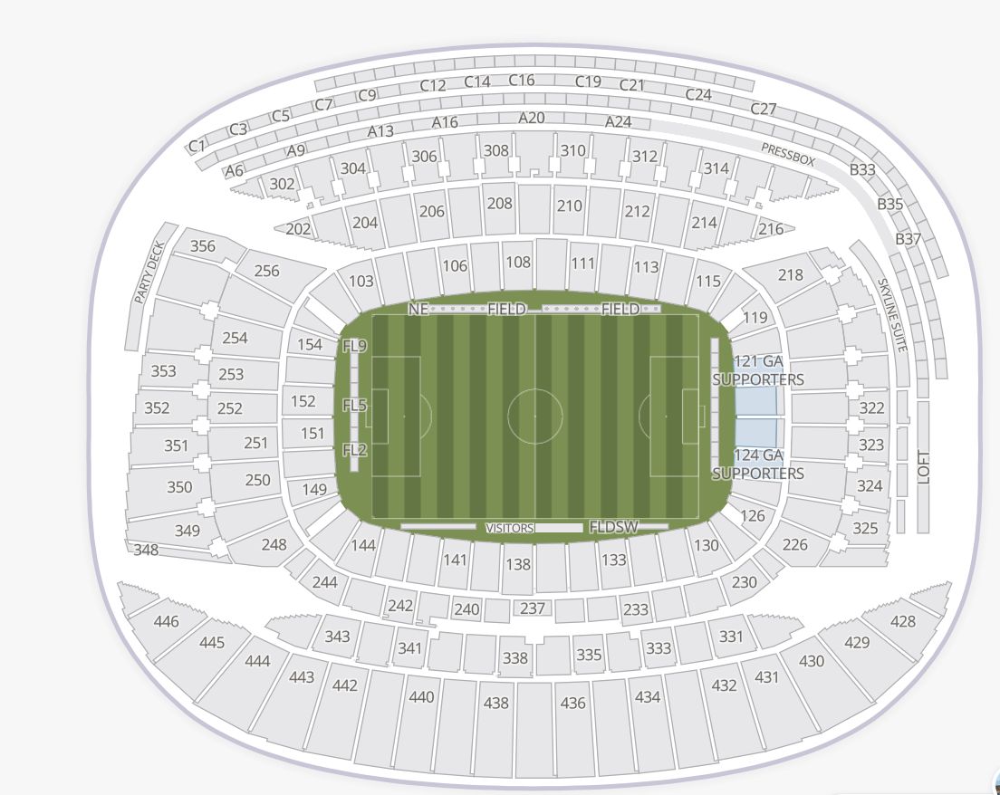

# Soldier Field visual reference

The supplied seating map is the visual direction for this prototype. It is stored in `soldier-field.svg`, which embeds the source raster image in an SVG container. Use it as a reference for broad composition and section hierarchy rather than as editable venue geometry.

## Visual cues to preserve

- A broad horizontal stadium footprint with rounded ends, viewed from directly above.
- A wide, horizontal field centered inside the seating.
- Distinct, asymmetric seating tiers with open concourses and section boundaries that follow each grandstand.
- Light, neutral seating surfaces contrasted with a restrained field-green treatment.
- Section labels arranged around the seating; keep labels legible and distinguishable by deck.

The supplied SVG is a visual orientation reference only. Runtime geometry remains in the venue's JSON data and is intentionally approximate and original; do not derive or trace exact seat geometry from the reference asset.
