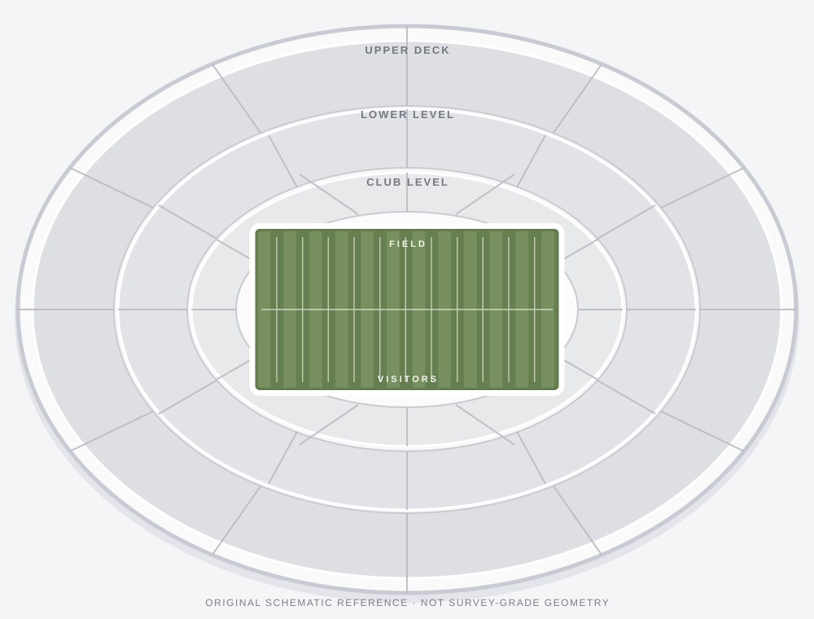

# Soldier Field overview visual reference

The supplied image is the visual direction for this prototype. The in-repository SVG is an original, editable schematic companion based on its broad visual cues; it is not a copy of the uploaded image or a pixel-accurate seating chart. The uploaded image itself is not bundled because it was provided inline and is not available here as a repository file.

## Visual cues to preserve

- A broad horizontal stadium footprint with rounded ends, viewed from directly above.
- A wide, horizontal American-football field centered inside the seating.
- Multiple deep oval seating tiers surrounding the field, with section boundaries that follow the curve of each tier.
- Light, neutral seating surfaces contrasted with a restrained field-green treatment.
- Section labels arranged around the seating; keep labels legible and distinguishable by deck.

The SVG is a visual orientation reference only. Runtime geometry remains in the venue's JSON data and is intentionally approximate. It must remain original and must not trace, bundle, or reproduce third-party venue-map assets, marks, or exact seat geometry.
